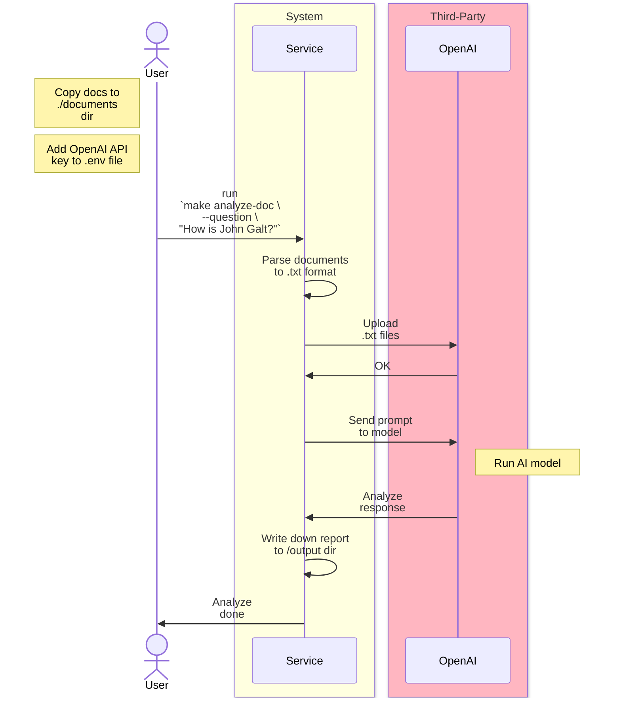

# 🤖 AI Document Analyzer

AI-Powered Document Analyzer: Revolutionizing Document-Reporting with Artificial Intelligence



## How to run

- Install Docker 🐳 and Make Ⓜ️
- Add your docs to the `./documents` directory
- Add your **OPEN_AI_API_KEY** to `.env` file

<!-- TODO use [VHS](https://github.com/charmbracelet/vhs) to create a prettier cmd illustration [POC](https://github.com/victorabarros/Learning/blob/a88f015a934ce6a5a77eb0de4c2d6584d3fe4f10/vhs/readme.md#L1) -->
```sh
make analyze-doc
python3 script.py --question "How is John Galt?"
# Report saved to ai_report_2025-01-21_16:46:01.887051
```

## Improvements

- check if the file is already processed before parse
- check if the file is already processed before upload
- expire uploaded file after used

## References

- https://cookbook.openai.com/
- https://github.com/f/awesome-chatgpt-prompts?tab=readme-ov-file#act-as-book-summarizer
- https://github.com/openai/openai-python
- https://platform.openai.com/docs/guides/prompt-engineering
- https://platform.openai.com/docs/guides/structured-outputs
- https://platform.openai.com/docs/libraries

---

<p align="center">
  <br/>
  Made in Brazil
  <br/>
  
</p>

<!--
TODO

- look this chinese opensourced gpt version https://ollama.com/library/deepseek-r1

-->
